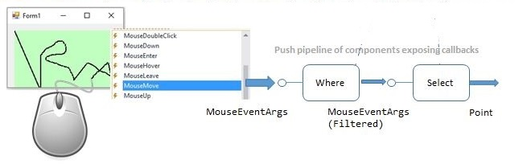

# Mouse move events sample

This sample makes the point how Rx.KQL works in-memory, without need to "store" events at all. To illustrate the concept, we are on purpose using events that are not intended to be stored - the mouse move events in a local WinForms application.

The most interesitng piece of [the code](Form1.cs) is: 

```cs
var leftButtonEvents = Observable.FromEventPattern<MouseEventArgs>(panel1, "MouseMove")
    .ToDynamic(m => m.EventArgs)
    .KustoQuery("where Button == \"Left\" | project X, Y");
```
Here:
- The form produces mouse move events, which can be used by adding a delegate like `panel1.MouseMove += SomeMethod;` where the method has signature `SomeMethod(Object sender, MouseEventArgs)`
- The Reactive factory method `FromEventPattern` converts this into `IObservable<MouseEventArgs>` which allows the user to define push-LINQ query using huge set of Rx stream-processing operators such as Joins, Grouping, etc.
- But since we want to do KQL instead, we use `ToDynamic()` which converts each event from static class into `IDictionary<string, object>`. This allows the KQL queries to change the schema on every stage of the pipeline, without need to keep static classes.
- Finally we do `.KustoQuery(...)` which
    - Discards the events unless the left button is pressed
    - If it is pressed, takes just X and Y coordinates

Executing the code results in building in-memory push pipeline like this:



The output of this pipeline is wired into a method which draws a small rectangle for each event. Here is a **TODO: recorded demo** or you can run teh sample yourself:

- run the project MouseMove
- move the mouse without pressing teh buttons - nothing happens because events are ignored by the `where` clause
- hold the left button and draw some picture. Notice there is no delay: the pixels show up in microseconds from the moment you moved the mouse 

Now let's illustrate the point of never storing the events. In WinForms, it is usually the responsibility of the developer to keep information about the picture, and re-draw it when the window is re-sized or loses and re-acquires focus.

But here we did not do any of this! Try re-sizing the window and notice how it deletes the picture.

In this sample, we assumed the developer understands Reactive Extensions, which is a high bar. One needs to learn lambda expressions, anonymous methods, etc. It is also easy to introduce a bug - e.g. by not keeping the `IDispossable` which is returned by `Subscribe `. In a production system this means the query will suddenly stop working when the `IDisposeable` instance is garbage-collected.

To make life simpler, Rx.KQL introduces high level wrapper which hides the complexity. See the [Multi-Query sample](../MultiQuery/Readme.md).

## See also

- The [Multi-Query sample](../MultiQuery/Readme.md) for Rx.KQL
- The original [Mouse Move sample](http://github.com/microsoft/Tx/tree/master/Samples/RxWinforms) for Reactive Extensions (Rx.Net)
