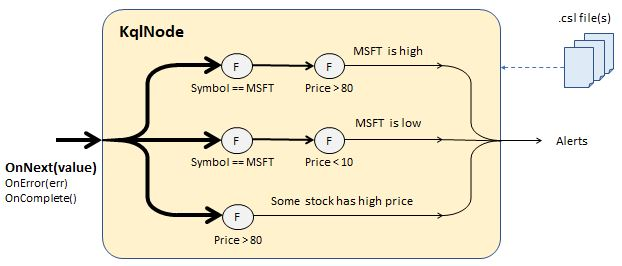

# Multi-query sample

In this sample, we show the most typical usage of Rx.KQL - to evaluate a set of real-time queries running simultaneously. 

As an example of real-time stream, we are generating fake stock tickers on which we are going to evaluate two queries about Microsoft: [MsftQueries.kql](MsftQueries.kql)
```
// MSFT is high
StockTickers 
| where Symbol == "MSFT" and Price > 80

// MSFT is low
StockTickers 
| where Symbol == "MSFT" and Price < 10
```
and one query about any symbol:
[AnySymbolQueries.kql](AnySymbolQueries.kql)
```
// Some stock has a high price
StockTickers 
| where Price > 80
```
To create the real-time processing node, we simply pass these file names in the factory method (see [Program.cs](Program.cs)):

```cs
static void Main()
{
    // Generate infinite, real-time stream of stock quotes
    IObservable<IDictionary<string, object>> quotes = 
    StockQuotes().ToObservable();

    // Evaluate multiple queries on the stream
    KqlNodeHub hub = KqlNodeHub.FromFiles(
        quotes, PrintOutput, "quotes", 
        "MsftQueries.csl", "AnySymbolQueries.csl");

    Console.ReadLine();
}
```
Here we started from variable `quotes` that represents a real-time stream and created `KqlNodeHub` which executes the three queries simultaneously. This is achieved by   translating each query into a push-pipeline of operators:


The method `PrintOutput` is defined by the user and will be invoked for every event on output:

```cs
static void PrintOutput(KqlOutput output)
{
    Console.WriteLine("{0} {1} {2}",
        output.Comment.Trim('\n', '\r', '\t', ' '),
        output.Output["Symbol"],
        output.Output["Price"]);
}
```

Here:
- The `Comment` property contains the comments such as `// MSFT is high`
- The Output property is the event that passed through. In this example there were only filters, so teh schema is not changing, but if there were `project`, `extend`, `summarize` etc. the schema may be different on output. See the list of [supported](SupportedFunctions.md) operators and functions.
- There is also a `Query` property, which has teh text of the query that produced the output

Finally, in most real applications we expect to have existing IObservable that represents the stream. Here for teh sake of example we construct the stream in two steps:

1: Create infinite IEnumerable sequence of tickers:
```cs
static Random _random = new Random();
static string[] _symbols = { "MSFT", "AAPL", "AMZN" };

static IEnumerable<IDictionary<string, object>> StockQuotes()
{
    while(true)
    {
        int index = _random.Next(_symbols.Length);
        int price = _random.Next(100);

        var ticker = new Dictionary<string, object>();
        ticker.Add("Symbol", _symbols[index]);
        ticker.Add("Price", price);
        
        Thread.Sleep(10);
        yield return ticker;
    }
}
```

2: Turn this into IObservable, using the existing verb `ToObservable()` from System.Reactive.Linq:
```cs
    // Generate infinite, real-time stream of stock quotes
    IObservable<IDictionary<string, object>> quotes = 
    StockQuotes().ToObservable();
```
## Performance and scale considerations
Major advantage of the real-time queries is that we can have large number of queries that are running simultaneously.

The performance of Rx.Net for simple operations is about 10 million events per second on a single CPU core. This means the evaluation of a simple step like a `where` takes 0.1 microseconds. Evaluation of more complex primitives like `summarize` may be expensive. Let's assume it is a whole millisecond. 

This means we will be able to run 10,000 simultaneous queries on a single CPU core.

Rx.KQL also provides performance counters, which can be accessed via the property `KqlQuery` on the `KqlOutput` object:
- `EvaluationCount` is the number of events passed as input to the query
- `EvaluationTotalMilliseconds` is the total time spend within the query

By dividing these counters, the user can calculate average duration it takes to evaluate the query on a single input event.