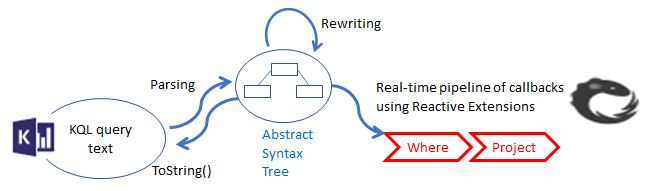
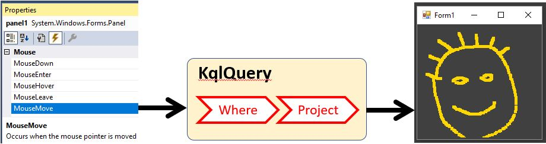

# Rx.KQL
Rx.KQL is a package that allows the usage of Kusto Query Language (KQL) on real-time stream of events. Here "real-time" means milliseconds of latency and throughput of millions of events per second on a single CPU core. 

This is achieved by translating the KQL into pipeline of [Reactive Extensions (Rx.Net)](https://github.com/Reactive-Extensions/Rx.NET) operators. Rx.Net supports not just filters, but also buffers, windows, aggregations, joins, etc. as described in chapter 11 of the book [Programming C# 5.0](http://shop.oreilly.com/product/0636920024064.do). 

In Scandium, Rx.KQL supports only `where`, `project` and `extend` which are atomic operations on single event. In Titanium we will implement some of the many statefull operators in Rx.

## Basic usage 
KQL is much easier to learn than LINQ and addresses broader user audience. Rx.KQL allows users that only want to use KQL to get the power of real-time standing queries.

### KqlNode class

KqlNode is a class hides the internal complexity of Rx, LINQ and Lambda-Expressions and brings the power of real-time query to users that only want to learn KQL.

Useful analogy is that KqlNode is a host, that keeps many simultaneously running real-time, standing queries:

    KqlNode node = new KqlNode();
    node.AddCslFile(@"..\..\MsftQueries.csl");
    node.AddCslFile(@"..\..\AnySymbolQueries.csl"); 

Here we created an instance, and then uploaded two files that were saved from Kusto Explorer:

**MsftQueries.csl:**

	// MSFT is high
	StockTickers 
	| where Symbol == "MSFT" and Price > 80
	
	// MSFT is low
	StockTickers 
	| where Symbol == "MSFT" and Price < 10

**AnySymbolQueries.csl:**

	// Some stock has high price
	StockTickers 
	| where Price > 80

Typically the user will define queries like these based on historical data recorded in Kusto. For events that come as a stream the best approach is using the [Kusto.StreamUpload](../KustoUploderSample/Readme.md) package. Once the queries are ready, the user can save the .csl files from Kusto Explorer and they can be passed to the KqlNode as above.

What is happening internally is building Rx operator pipelines like this:

Here:

- the csl files are configuration that is passed first,
- then events are pushed in immediately as they occur (no storage is involved!)
- width of arrows represents volume in events per second. Since most events don't match any of the filters, they are **dropped**
- if an event matches some filter, we get alert on output

Filter is the simplest example of **standing-query**. Standing queries in general are data-flow graphs how to produce output event. This is concept analogous to "execution plan" in SQL except (1) the user registers a query (2) events arrive.

Let's now subscribe for the output alerts:

    using (node.Subscribe(alert => Console.WriteLine("{0} {1} {2}", 
        alert.Comment.Trim('\n','\r','\t',' '),
        alert.AlertOccurrance["Symbol"],
        alert.AlertOccurrance["Price"])))
	{ ...}

This way we send each alert to the console, as it occurs. 

This code will also work without the `using` statement. However, one of the most common bugs in using real-time queries is forgetting that `Subscribe` returns `IDisposable`. The caller must keep reference to it, otherwise the subscription is canceled. The `using` is just the common C# practice to guarantee the `IDisposable` object is alive while the code in {...} is executed.

Finally, let's produce some events:

    while (true)
    {
        var ticker = GenerateTicker();
        node.OnNext(ticker);
        Thread.Sleep(10);
    }

This invokes the method:

	static IDictionary<string, object> GenerateTicker()

Which does random stock ticker generation. Some of the tickers match the above queries, and we see alerts on the console output:

	// Some stock has high price AMZN 93
	// MSFT is high MSFT 83
	// Some stock has high price MSFT 83
	// Some stock has high price AAPL 94
	// MSFT is high
	// MSFT is low MSFT 2

Note that the random generation here is not intended to simulate actual stock market behavior. It is simply generating random symbol and random price from 0 to 99. See the entire code in [Program.cs](Program.cs)

### Using KQL functions in real-time queries
Sometimes, many queries have fragment that is the same. In actual Kusto (stored data) we can take such code, and encapsulate it in reusable function.

The KqlNode provides the same functionality. The '.create function' definitions  just need to be included in some of the csl files.

## Advanced usage
Rx.KQL has public classes that can be used in more advanced scenarios

### Parsing KQL into Abstract-Syntax-Tree
The parsing functionality of Rx.KQL is available separately, and can be used for many other purposes:

Here the query text can be parsed as Abstract Syntax Tree (AST) by calling constructors like:

	var q = new Query(kqlText);

The AST is internally being used in the KqlNode class described above. It is also useful for other purposes:

- modifying the AST (rewriting) such as optimizing the query
- building the AST from some other expression definition such as ArcSight XML or SQL
- translating the AST into another language such as Scala

The reverse action is going from AST to KQL string:

	string kql = q.ToString();

### Using KQL in Rx queries
Rx.KQL provides another mode of usage that is intended for developers, who are fluent with real-time events in C#, LINQ, and Rx.Net

In this mode, real-time KQL processing can be intermixed as an operator in any Rx real-time pipeline. Let's imagine the following code in the context of WinForms application (no Kusto involved!):

	var points = Observable.FromEventPattern<MouseEventArgs>(panel1, "MouseMove")
       .ToDynamic(m => m.EventArgs)
       .KqlQuery("where Button == \"Left\" | project X, Y");

Here:

- we take the real-time stream of events generated by moving the mouse
- we turn them to a dynamic object `IDictionary<string, object>`
- we apply KQL query that ignores events unless the left button is pressed, and then only take (X,Y) coordinates

The output of the Rx pipeline is drawing pixels as:

	_subscription = points.Subscribe(p =>
	    {
	        panel1.CreateGraphics().FillRectangle(pen.Brush, p.X, p.Y, 5, 5);
	    });

Here: 

- the variable `points` represents the output of the real-time query
- `_subscription` is example how one should keep the IDisposable as class member

All the event processing happens on the stream. No events are ever stored, and the final result is just pixels. If the user re-sizes the window and loses some of the pixels, they cannot be recovered. 

See also:

- The code of this [WinForm application](../../RxKustoMouseMove/Form1.cs)
- The original [sample of Rx](https://github.com/Microsoft/Tx/tree/master/Samples/RxWinforms/Readme.md)
