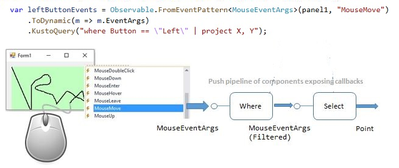

# The Rx.Kql.MouseMove Sample

&copy; Microsoft. All rights reserved.

Rx.Kql.MouseMove is a simple Windows Forms application that demonstrates how to use an "Embedded Query" to gather and process mouse events. The application captures these events and draws dots on the canvas, green dots for the left mouse button press, gold for the right mouse button.

The sample application uses the System.Reactive.Linq NuGet Package. For more information, see the [Reactive.Linq SDK](https://github.com/dotnet/reactive).  And it uses the System.Reactive.Kql NuGet Package. For more information, see the [Reactive.Kql SDK](https://github.com/dotnet/reactive).

## Exploring the Sample

The sample uses the System.Reactive.Linq `Observable` class's `FromEventPattern` method to capture the mouse move and button events. The System.Reactive.Linq RxExtensions `KustoQuery` method is used to filter the event stream to only grab left mouse button events, or right mouse events, depending upon which one is pressed.

This is the code for tracking left mouse move events:

``` csharp
var leftButtonEvents = Observable.FromEventPattern<MouseEventArgs>(panel1, "MouseMove")
    .ToDynamic(m => m.EventArgs)
    .KustoQuery("where Button == \"Left\" | project X, Y");
```
The can be diagramed like this:



It then uses the System.Reactive.Kql RxExtensions `Subscribe` method to register the events to an observable sequence.

``` csharp
_subscriptions.Add(leftButtonEvents.Subscribe(p =>
{
    panel1.CreateGraphics().FillRectangle(leftButtonPen.Brush, float.Parse(p["X"].ToString()), float.Parse(p["Y"].ToString()), 5, 5);
    ;
    leftButtonTextBox.Text = $@"Left: {leftButtonCounter++}";
    noButtonTextBox.Text = $@"Moves: {noButtonCounter++}";
}));
```

The same is done for the right mouse button and mouse move events stream. This is an embedded query using the Kusto language on real-time feed of events. The x and y coordinates are displayed in the upper right corner of the application.

This way, as the mouse is moved, the mouse move events stream in real-time to the output application as a series of colored dots.

The input is real-time feed of mouse events, **without the data being stored first**. This is fundamentally different than real Kusto usage in which the data has to be stored first.

These Mouse-Move events originally come as instances of strongly typed class. The  `ToDynamic` extension method converts the strongly-typed events into name-value dynamic objects.

Next the sample code performs a Kusto-like pipeline of filter and projection. Because the query is simple filter and transform, no events are kept in memory. Subset of the events is propagated to the drawing callback and once a point is drown are discarded. This way it works on infinitely long stream of events.

This is similar to Reactive Extensions (Rx .Net) and the [original Rx sample](https://github.com/Microsoft/Tx/blob/master/Samples/RxWinforms/Readme.md) on mouse move events.

## Similarities with LINQ

The main similarity is that the query was defined in-line in the C# code. It does the same as .Where and .Select pipeline in the [original Rx sample](https://github.com/Microsoft/Tx/blob/master/Samples/RxWinforms/Readme.md)

It is also compose-able as a pipeline, only using | instead of . notation.

## Differences from LINQ

Embedded queries have no knowledge of the C# context they are executed in. No access to functions and extension methods, no access to variables in scope etc.

Because the query is just a string it can also come from configuration or user input and can be changed without recompiling the code.

The usage of dynamic types makes queries less efficient than using statically-typed classes.

Finally, there is no comprehension (SQL-like) syntax. Once you learn the pipeline principles behind LINQ or Kusto languages it is actually simpler than comprehension for nested queries.

## Compose-ability

As you can see from the sample, the Kusto-like query was just one operator in LINQ-Rx pipeline of Observables.

This is possible because we only support small subset of the Kusto language (no joins, no graphics etc.). It is just a pipeline that takes dynamic objects and produces dynamic objects. This is classic example of "Function" which fits as a LINQ Verb.

## See Also

[Rx.Kql Node Sample](../Rx.Kql.NodeSample/Rx.Kql.NodeSample.Readme.md)

[CDOC Samples](../../CDOC.Samples.Readme.md)