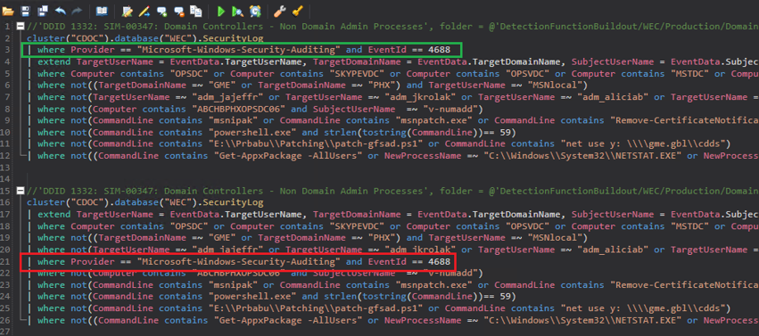

# Rx.Kql.NodeSample

&copy; Microsoft. All rights reserved.

Rx.Kql.NodeSample is a simple Console application that demonstrates one of the many possible use of the Rx.Kql NuGet package for Kusto Query Language (KQL), It simulates a real-time stream of events. In the sample, the data being streamed are simulated stock ticker data, but you can use Rx.Kql to work with a variety of data sources.

## About the Rx.Kql NuGet Package

Rx.KQL is a NuGet package that provides easy use of the Kusto Query Language (KQL) on real-time stream of events. Here "real-time" means milliseconds of latency and throughput of millions of events per second on a single CPU core.

This is achieved by translating the KQL into pipeline of [Reactive Extensions (Rx.Net)](https://github.com/Reactive-Extensions/Rx.NET) operators. Rx .Net supports not just filters, but also buffers, windows, aggregations, joins, etc.

## Exploring the Sample

The Rx.Kql.NodeSample demonstrates one possible use of the `KqlNode` class in the Rx,Kql NuGet package. The sample creates an instance of this class then adds two Kusto queries to the node, using the KqlNode `OnNext` method to get the data from the source. It displays these data in the Console and gets another set.

The sample uses the ad hoc  `GenerateTicker` method as the simulated source of stock ticker data.

### Instantiating the KqlNode class

This is the core of the sample application. The application creates an empty instance of the KqlNode class and then adds two KQL queries using the `AddCslFile` method.

The Kusto queries that are added to the node are used to determine whether the incoming simulated stock data is "high" or "low". These queries are simplistic, but you can use the Kusto Query Language to form very sophisticated and complex queries.

The `KqlNode` class abstracts away the internal complexity of Rx .NET, LINQ and Lambda-Expressions and brings the power of real-time query to developers who only want to learn KQL.

``` csharp
KqlNode node = new KqlNode();
node.AddCslFile(@"..\..\MsftQueries.csl");
node.AddCslFile(@"..\..\AnySymbolQueries.csl");

using (node.Subscribe(alert => Console.WriteLine("{0} {1} {2}",
    alert.Comment.Trim('\n','\r','\t',' '),
    alert.Output["Symbol"],
    alert.Output["Price"])))
{
    while (true)
    {
        var ticker = GenerateTicker();
        node.OnNext(ticker);
        Thread.Sleep(10);
    }
}
```

The KqlNode is like a host, that keeps many simultaneously, real-time, standing queries running. You can add as many queries as you need. To add Kusto queries, create a query in a *.cls file and add the query to the Node by using the KqlNode `AddCslFile` method, as shown below:

``` csharp
KqlNode node = new KqlNode();
node.AddCslFile(@"..\..\MsftQueries.csl");
node.AddCslFile(@"..\..\AnySymbolQueries.csl");
```

These are the queries added to the KqlNode instance:

### MsftQueries.csl

This query labels prices over 80 as 'high' and prices below 10 as 'low'.

``` text
// MSFT is high
StockTickers
| where Symbol == "MSFT" and Price > 80

// MSFT is low
StockTickers
| where Symbol == "MSFT" and Price < 10
```

### AnySymbolQueries.csl

This query only processes data where the Price is over 80.

``` text
// Some stock has high price
StockTickers
| where Price > 80
```

Typically, you will define Kusto queries like these based on historical data recorded in Kusto. For events that come as a stream the best approach is using the `Kusto.StreamUpload` package. Once the queries are ready, you can save the *.csl files from Kusto Explorer and they can be passed to the KqlNode as above.

What is happening internally is building Rx operator pipelines like this:


Here:

- The *.csl files are the query that is passed first.
- Then events are pushed in immediately as they occur (no storage is needed)
- The width of the arrows represent the volume of events in events per second.
- Most events don't match any of the filters, so they are **dropped**.
- if an event matches some filter, we get an output in the Console.

The sample uses two queries that are filters. A **filter** is the simplest example of a **standing-query**. Standing queries in general are data-flow rules for how to output an incoming event.

This is how the sample subscribes to the stream of data from the ad hoc `GenerateTicker` method:

``` csharp
using (node.Subscribe(alert => Console.WriteLine("{0} {1} {2}",
    alert.Comment.Trim('\n','\r','\t',' '),
    alert.Output["Symbol"],
    alert.Output["Price"])))
```

This way we send each alert (stock ticker data) to the Console, as it occurs.

**Note** - It's important to have the `using` statement. This is because the KqlNode `Subscribe` method returns an `IDisposable`. The caller must keep a reference to the Subscription, otherwise the it will be canceled. The `using` is a common C# best practice to guarantee the `IDisposable` object is alive while the intervening code is executed.

This is how the sample produces the simulated stock ticker data:

``` csharp
while (true)
{
    var ticker = GenerateTicker();
    node.OnNext(ticker);
    Thread.Sleep(10);
}
```

This calls the ad hoc  `GenerateTicker` method:

``` csharp
static IDictionary<string, object> GenerateTicker()
{
    int index = _random.Next(_symbols.Length);
    int price = _random.Next(100);

    dynamic ticker = new ExpandoObject();
    ticker.Symbol = _symbols[index];
    ticker.Price = price;

    return ticker;
}
```

The KqlNode `OnNext` method sends the generated stock ticker data to the subscription.

Some of the tickers match the above queries, and we see alerts on the console output:

```text
// Some stock has high price AMZN 93
// MSFT is high MSFT 83
// Some stock has high price MSFT 83
// Some stock has high price AAPL 94
// MSFT is high
// MSFT is low MSFT 2
```

**Note**  - The random generation here is not intended to simulate actual stock market behavior. It is simply generating random symbol and random price from 0 to 99.

### Best practices for query performance on a stream


 - Place filtering conditions HIGH in the pipeline to avoid unnecessary work for Rx.Kql to perform.  
 - Place extends AFTER high order bit filtering has occurred, which will prevent extend operations on events which later on in processing will get dropped.
 - Order by is a valid function on the stream, when performing Summarize operations
 - Filtering by Time fields is also allowed, but doesn’t increase performance on the stream, as an atomic detection Time field filter is treated as just another where clouse




### Supported Functions

Kusto queries support a wide variety of functions and operators. To see a complete list of these, see [Supported Function](SupportedFunctions.md).

## See Also

[Rx.Kql MouseMove Sample](../Rx.Kql.MouseMove/Rx.Kql.MouseMove.Readme.md)

[CDOC Samples](../../CDOC.Samples.Readme.md)